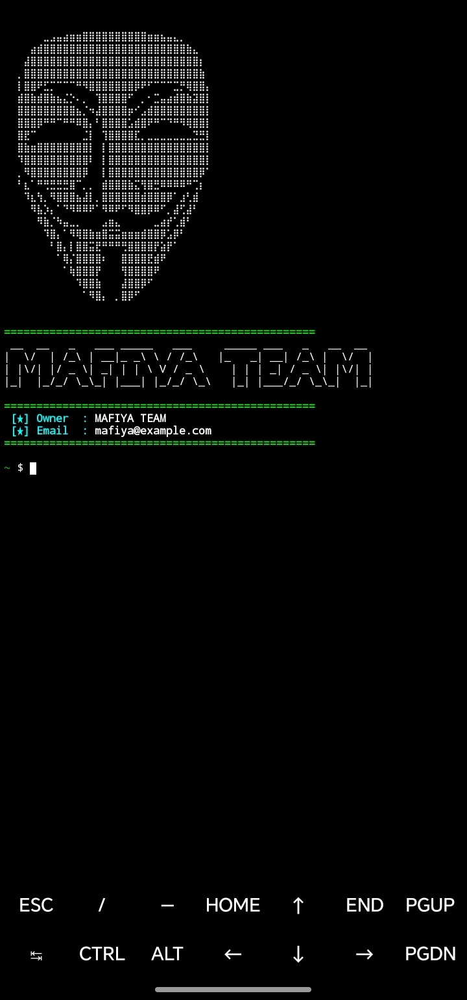

# 🎭 Termux Anonymous Custom Banner

A stylish, hacker-inspired custom banner script for Termux featuring an Anonymous ASCII Braille logo and stylized terminal elements.

---

## 📸 Preview## 📸 Preview




---

## ⚙️ Features

* 🎭 Clean Anonymous Mask ASCII Art (Optimized for Mobile)
* ⚡ Lightweight and fast execution
* 🎨 Custom Green & White Cyber Aesthetic
* 📱 Fully fit for portrait Android screens

---

## 🚀 Installation Guide

Run the following commands step-by-step in your Termux application:

```bash
# Update and Upgrade Packages
pkg update && pkg upgrade -y

# Install Required Dependencies
pkg install python git figlet -y

# Clone this Repository
git clone [https://github.com/Achiachiofficial/-Mafiyaxteam-banner.git](https://github.com/Achiachiofficial/-Mafiyaxteam-banner.git)

# Navigate to the Directory
cd -Mafiyaxteam-banner

# Run the Banner Script
python banner.py

```

### 🛠️ Customization
​To change the Name and Email to your own details:

# 01 ⏩Open the script with nano:
```bash
nano banner.py
```
# 02 ⏩Edit the USERNAME and EMAIL variables inside the code.
# 03 ⏩Save and exit by pressing CTRL + X, then Y, then ENTER.


### 📱 Connect with Us
​Follow for more Termux tools, tutorials, and scripts:


## TikTok
​<p align="center">Made with ❤️ by MAFIYAˣ TEAM⚡</p>


